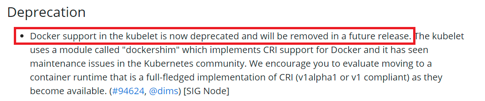

# Kubernetes 1.20 is deprecating Docker Runtime

A new Kubernetes 1.20 has been released in December 2020. 

The [Release Notes](https://kubernetes.io/blog/2020/12/08/kubernetes-1-20-release-announcement/) says that Kubernetes [deprecates](https://kubernetes.io/docs/setup/release/notes/#deprecation-1) Docker and will remove it in future releases:

This  raises some  questions:
* What does it mean for you as a Kubernetes user or administrator?
* Who is impacted?
* ???

Watch this short video (~12 min) to get answers:

[Kubernetes is dropping Docker support - What does it mean for YOU?](https://www.youtube.com/watch?v=7KUdmFyefSA)

#### Some Other resources:
* [Don't Panic: Kubernetes and Docker](https://kubernetes.io/blog/2020/12/02/dont-panic-kubernetes-and-docker/)
* [Kubernetes 1.20 is deprecating Docker Runtime](https://octopus.com/blog/kubernetes-1-20-deprecating-docker-runtime#kubernetes-1-20-is-deprecating-docker-runtime-what-does-this-mea)

