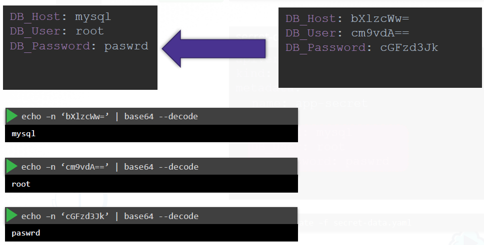

# Chapter time 1

## Container Orchectration
Container orchestration is all about managing the lifecycles of containers, especially in large, dynamic environments.

Basic questions to be addressed:
* What if your application relies on other containers such as database or messaging services or
other backend services?
* What if the number of users increase and you need to scale your application? You would also like to scale down when the load decreases


To enable these functionalities you need an underlying platform with a set of resources. The platform needs to orchestrate the connectivity between the
containers and automatically scale up or down based on the load. This whole process of automatically deploying and managing containers is known as **Container Orchestration**.

### Orchestration Technologies:
* Docker Swarm
* Kubernentes
* MESOS


## Kubernetes Architecture
What is a Kubernetes cluster?


* A cluster is a set of nodes grouped together. 
* A node (also known as a minion in the past) is a machine physical or virtual on which  kubernetes is installed. 
*

### Components

A Kubernetes cluster consists of different components, let's look into the most important ones:


* **API server** acts as the front end for kubernetes. The users, management devices, Command line interfaces all talk to the API server to interact with the kubernetes cluster.


* **ETCD key store**. [ETCD](https://etcd.io) is a distributed reliable key value store used by kubernetes to store all data used to manage the cluster. 
  * When you have multiple nodes and multiple masters in your cluster, **etcd** stores all that information on all the nodes in the cluster in a distributed manner. 

* **Scheduler** is responsible for distributing work or containers across multiple nodes. It looks for newly created containers and assigns them to Nodes.

* **Controllers** are the brain behind orchestration. They are responsible for noticing and responding when nodes, containers or endpoints goes down. The controllers makes decisions to bring up new containers in such cases.

* **Kubelet** is the agent that runs on each node in the cluster. The agent is responsible for making sure that the containers are running on the nodes as expected.

* **Container Runtime** is a container hosting platform. This doesn’t habe to be docker, there are other container runtime alternatives available such as *Rocket* or *CRIO*

More details about the components can found here: [Kubernetes Components](https://kubernetes.io/docs/concepts/overview/components/).

### Master vs Worker
So, there are two types of servers – Master and Worker(s) and a set of components that make up Kubernetes.
But how are these components distributed across different types of servers. In other words, how does one server become a master and the other slave?


* The worker node is were the containers are hosted;
* The worker nodes have the kubelet agent that is responsible for interacting with the master;
* The master server has the **API server** and that is what makes it a master;
* All the information gathered are stored in a key value store on the Master;
* The master also has the controller manager and the scheduler;

There are also other components as well, but we will stop there. The idea now is to understand what components constitute the master and
worker nodes. 

### kubectl CLI

*Kubectl CLI* is the kube command line tool or **kubectl** or kube control as it is also called. The **kubectl**  is used to deploy and manage applications on a kubernetes cluster, to get cluster information, get the status of nodes in the cluster and many other things.

Examples:

```
kubectl cluster-info
```
The command is used to view information about the cluster


```
kubectl get nodes
```
The command is used to list all the nodes of the cluster

## Kubernetes Concepts
POD. What is a POD?

A POD is the smallest object, that you can create in Kubernetes.
Kubernetes does not deploy containers directly on the worker nodes. The containers are encapsulated into a POD. A POD is a single instance of an application. 

Here we see the simplest case were you have a single node kubernetes cluster with a single instance of your application running in a single docker container encapsulated in a POD.


What if the number of users accessing your application increase and you need to scale your application? We create a new POD with a new instance of the same application.

What if the user base FURTHER increases and your current node has no sufficient capacity? Then you deploy additional PODs on a new node in the cluster. You will have a new node added to the cluster to expand the cluster’s physical capacity.


To scale UP you create new PODs and to scale down you delete PODs. You do not add additional containers to an existing POD to scale your application.


## Kubernetes Networking

Let's start with a single node kubernetes cluster. The node has an IP address, for example  192.168.1.2. This is the IP address we use to access the kubernetes node, SSH into it etc.

In case of Minikube setup we are talking about the IP address of the minikube virtual machine inside your Hypervisor. Your laptop may be having a different IP like 192.168.1.10. 


In Kubernetes the IP address is assigned to a POD. Each POD in kubernetes gets its own internal IP Address. In this case its in the range 10.244 series and the IP assigned to the POD is 10.244.0.2. 

So how is it getting this IP address? When Kubernetes is initially configured it creates an internal private network with the address 10.244.0.0 and all PODs are attached to it. When you deploy multiple PODs, they all get a separate IP assigned. 

The PODs can communicate to each other through this IP. But accessing other PODs using this internal IP address MAY not be a good idea as its subject to change when PODs are recreated. We will see better ways to establish connections between PODs.


But how does it work when you have multiple nodes in a cluster?


In this case we have two nodes running kubernetes and they have IP addresses 192.168.1.2 and 192.168.1.3 (they are not part of the same cluster yet).

Each of them has a single POD deployed. As discussed, these pods are attached to an internal network and they have their own IP addresses assigned. However they are the same. The two networks have an address 10.244.0.0 and the PODs deployed have the same address too.

This is NOT going to work well when the nodes are part of the same cluster. The PODs have the same IP addresses and that will lead to IP conflicts in the network. That is one issue. 

When a kubernetes cluster is setup, kubernetes does NOT automatically setup any kind of networking to handle these issues. This is another issue. 

Kubernetes expects that a networking which meets certain fundamental requirements will be setup. Some of these are that all the PODs in a cluster must be able to communicate  without having to configure [NAT](https://en.wikipedia.org/wiki/Network_address_translation) (Network Address Translation). 

All nodes must be able to communicate with PODs and all PODs must be able to communicate with the nodes in the cluster. 

A networking solution that meets these criteria needs to be setup when installing a cluster. There are multiple pre-built solutions available for this. 


Some of them are:

* Cisco ACI networks
* Cilium 
* Big Cloud Fabric
* Flannel
* Vmware NSX-t 
* Calico

Depending on the platform where where you deploy your Cluster on you may use any of these solutions.


So, go back to the cluster, with the networking setup:


Now it manages the networks and IPs in the nodes and assigns a different network address for each network in the nodes. This creates a virtual network of all PODs and nodes were they are all assigned a unique IP Address. 

Using simple routing techniques the cluster networking enables communication between the different PODs or Nodes to meet the networking requirements. Thus all PODs can now communicate to each other using the assigned IP addresses.

## PODs with YAML

Any  kubernetes definition file always contains 4 top level fields. These are top level or root level properties, they are required, so they must be in a configuration file.


* **apiVersion**: This is the version of the kubernetes API we’re used to create an object. Depending on what we are trying to create we must use the right apiVersion. 

* **kind**: refers to the type of object that will be created. In this example it is a Pod. Some other possible values here could be ReplicaSet or Deployment or Service, or others. 

* **metadata**: is data about the object like its name, labels etc. It’s important to note that under metadata, you can only specify name or labels (or anything else that kubernetes expects to be here). You cannot add any other property. However, under labels you can have any kind of key or value pairs as you wish;

* **spec**: the section specifies container(s) in a Pod - a container name and an image. 


The property *containers* is a list because PODs can have multiple containers within them. In this case we will only add a single item in the list, since we plan to have only a single container in the POD. The item in the list is a dictionary, so add a name and image property. The
value for image is nginx .


To create a Pod run the following command:

```
kubectl create -f pod-definition.yaml
```

To check a created Pod:

```
kubectl get pods
```

To get more details about a Pod:

```
kubectl describe <pod-name>
```

### Pods life cycle

Each pod has a status object, the status object keeps the phase field.


* **Pending**: The Pod has been accepted by the Kubernetes system, but one or more of the Container images has not been created. This includes time before being scheduled as well as time spent downloading images over the network, which could take a while.

* **Running**:	The Pod has been bound to a node, and all of the Containers have been created. At least one Container is still running, or is in the process of starting or restarting.	

* **Succeeded**: All Containers in the Pod have terminated in success, and will not be restarted.

* **Failed**: All Containers in the Pod have terminated, and at least one Container has terminated in failure. That is, the Container either exited with non-zero status or was terminated by the system.


The advantage of Kubernetes is its ability to restart the pods/containers automagically. This can be define with the **restartPolicy** field. 

The field accepts the values: 
* **Always**
* **onFailure**
* **Never**

The default value is Always. That is whenever a pod is terminated with failed status, then the Kubernetes system will try to restart the pod.

## Environment Variables

Let's see how to pass in an environment variable in Kubernetes. To set an environment variable, use the "env" property, it an array. 


This is a direct way of specifying the environment variables using a plain key value pair format. However there are other ways of setting the environment variables such as using **ConfigMaps** and **Secrets**. The difference in this case is that instead of specifying value, we say valueFrom . And then a specification of configMap or secret.


### ConfigMap

ConfigMaps are used to pass configuration data in the form of key value pairs in Kubernetes.

When a POD is created, inject the ConfigMap into the POD, so the key value pairs are available as environment variables for the application hosted inside the container in the POD.

So there are two phases involved in configuring ConfigMaps:
- first: create the ConfigMaps;
- second: inject them into the POD.

Just like any other Kubernetes objects, there are two ways of creating a ConfigMap. The imperative way - without using a ConfigMap definition file and the Declarative way by using a ConfigMap Definition file.

##### Declarative way:


##### Imperative way:

```
kubectl create configmap app-config --from-literal=APP_COLOR=blue --from-literal=APP_MODE=prod
```

To inject an environment variable in the POD, add a new property to the container called envFrom. The envFrom property is a list, so we can pass as many environment variables as required. 


### Secret

Secrets are used to store sensitive information, like passwords or keys. They are similar to configMaps, except that they are stored in an encoded or hashed format. As with configMaps, there are two steps involved in working with Secrets. First, create the secret and second inject it into Pod.

##### Declarative way:

As mentioned before, secrets are used to store sensitive data and are stored in an encoded format. So, while creating a secret with the declarative approach, you must specify the secret values in a hashed format.


##### Imperative way:

```
kubectl create secret generic app-secret --from-literal=DB_host=mysql --from-literal=DB_User=root --from-literal=DB_Password=passwrd
```
When creating a secret in imperative way you don't need to encode values.

##### Encode/Decode secrets

How do you convert the data from plain text to an encoded format?

On a linux host run the command echo –n followed by the text you are trying to convert, which is mysql in this case and pipe that to the base64 utility.


For decoding use the same base64 command you used in linux to encode it, but this time add a decode option to it:




To inject secrets in the POD, add a new property to the container called envFrom. The envFrom property is a list, so we can pass as many environment variables as required. 


## Commands

### 1. Create a POD

There are two ways to create/delete any object in Kubernetes: 
* Declarative - using configuration files;
* Imperative - using commands

#### 1.1 Declarative way
```
kubectl create -f <pod-definition-file>
```


#### 1.2 Imperative way

Generate YAML-file without creating a POD:
```
kubectl run my-nginx --image=nginx --restart=Never -o yaml --dry-run
```
- **my-nginx** - the name of a POD
- **nginx** - the image used to create  a POD;
- **Never** - restart policy;
- **yaml** - generate output in YAML-format;
- **dry-run** - just generate output YAML. No POD will be created


Create a POD:
```
kubectl run my-nginx --image=nginx --restart=Never
```


### 2. Get info about PODs

Get all the pods created in the default namespace:

```
kubectl get pod
```

Get extended info about PODs created in the default namespace:

```
kubectl get pod -o wide
```

Get details about a particular by its name

```
kubectl describe pod <pod-name>
```


### 3. Get container logs

```
kubectl logs <pod-name>
```


### 4. Execute a command in a container

Run the *env* command in a container:

```
kubectl exec -it <pod-name> -- env
```

Run a shell in a container:

```
kubectl exec -it <pod-name> -- bash
```


### 5. Delete PODs

#### 5.1 Declarative way

```
kubectl create -f <pod-definition-file>
```


#### 5.2 Imperative way


```
kubectl delete pod <pod-name>
```

### 6. ConfigMaps

#### 6.1 Cretate ConfigMap

Create a ConfigMap with the name **app-config** and key/values:

- APP_COLOR=blue
- APP_MODE=prod

```
kubectl create configmap app-config --from-literal=APP_COLOR=blue --from-literal=APP_MODE=prod
```


#### 6.2 View ConfigMap

Get all the ConfigMap-s in the default namespace:
```
kubectl get configmap 
```
or
```
kubectl get cm 
```

Get a ConfigMap by a name:
```
kubectl get configmap <config-map-name>
```

#### 6.2 Describe ConfigMap

Describe all the ConfigMap-s in the default namespace:
```
kubectl describe configmap 
```

Describe a specific ConfigMap:
```
kubectl describe configmap <config-map-name>
```

#### 6.3 Delete ConfigMap
```
kubectl delete configmap <config-map-name>
```


### 7. Secrets

#### 6.1 Cretate Secrets
```
kubectl create secret generic app-secret --from-literal=DB_host=mysql --from-literal=DB_User=root --from-literal=DB_Password=passwrd
```


#### 6.2 View Secrets

Get all Secrets in the default namespace:
```
kubectl get secrets
```

Get a Secret by a name:
```
kubectl get secret <secret-name>
```


#### 6.3 Delete Secrets

