# Kubernetes Services


## Services

According to the Kubernetes [documentation](https://kubernetes.io/docs/concepts/services-networking/service/) - a Service is an abstraction which defines a logical set of Pods and a policy by which to access them (sometimes this pattern is called a micro-service).

Services help us to connect kubernetes applications together with other applications users. 

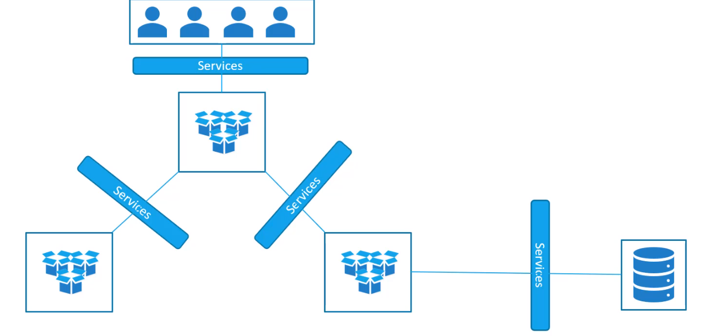

For example, our application is a group of pods - front-end, back-end, DB. In Kubernetes world PODs don't communicate directly to each other, services are used for this.
The services enable [loose coupling](https://www.linkedin.com/pulse/loose-coupling-microservice-architecture-patrick-van-vuuren/) between micro-services in our application. 


### Use Case example

Let's look at one use case for the services.

We deployed our web-application as POD to a cluster - how can an external user can access a page?

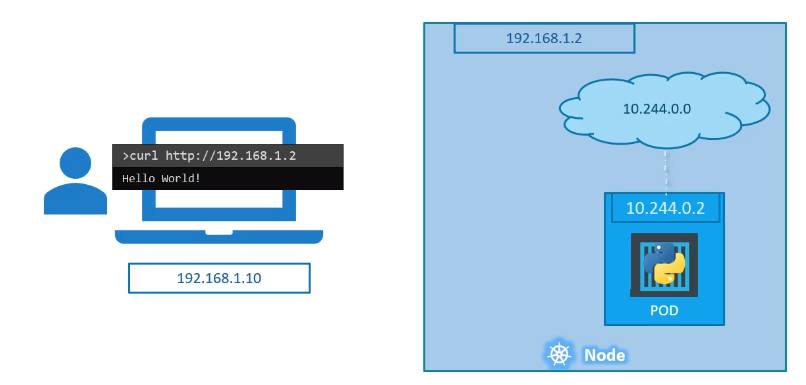


The existing setup:
* A cloud has one node with the IP 192.168.1.2;
* A user laptop is on the same network and has IP  192.168.1.10;
* The internal POD network is in the range 10.244.0.0;
* The POD is IP 10.244.0.2;

It is not possible to access (ping) the POD from the user's laptop because they are in different networks.

What are the options to see the web-page?

It is possible to SSH from the laptop to the Node and run access the POD **from the Node** like this:

```
ssh 192.168.1.2
curl http://10.244.0.2
```

This will work but this is not what we really want.

We want to access the POD directly from the laptop running the command like this:

```
curl http://192.168.1.2
```

So, we need something that will help us to access the **POD through the Node** from the laptop. 

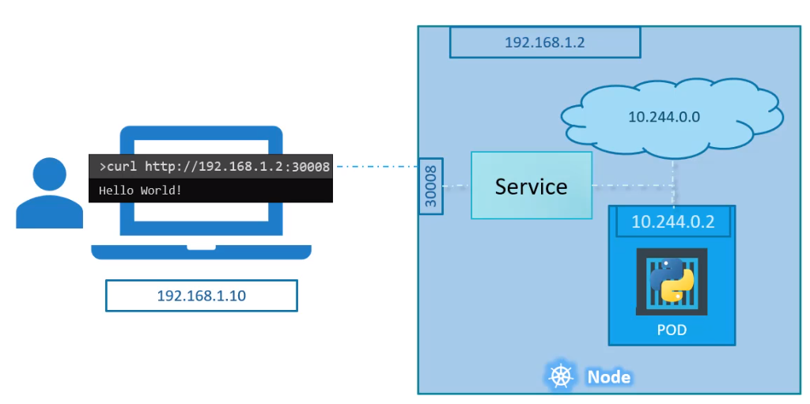

This is where a Kubernetes Service comes to help. A Service listens a request on a Node-port and forward the request to a POD. This type service called **NodePort**


### Services Types

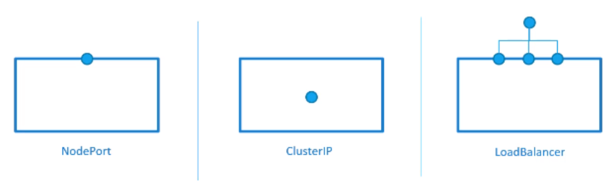

* *NodePort*: the service makes an **internal port of POD** available on a **Node**;
* *ClusterIP*: a service creates a virtual IP inside a cluster to enable communication of different services (such as set of front-end servers to a set of back-end servers);
* *LoadBalancer*: it provides a load-balancing for an application in supported cloud providers;

### Service NodePort

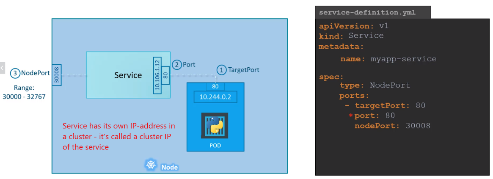

* Node, Service and POD have their own IP addresses;
* Service forwards requests to the TargerPort (80);
* NodePort (30008) is used to access the web-service externally; 
* In a service-definition file: if targetPort is not provided - it is assumed to be the same as a port;
* In a service-definition file: if **nodePort** is not provided - a  free port in a (range 30000-32767) will be automatically allocated;

#### Create a service

As any Kuberneted object, a service can be created with a definition file (declarative way):

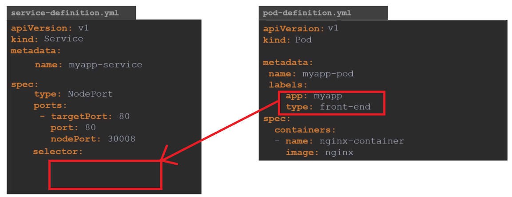

* Services CANNOT connect to PODs via POD-IP addresses (because POD-IPs are not static and changed every time when POD is created and destroyed);
* Services are connected to PODs via POD-labels (POD-labels are still the same when POD is created/deleted);

#### Commands to create, get and request a service

Create a service from a definition-file:
```
kubectl create -f service-definition.yaml
```

Get created services:
```
kubectl get services
```

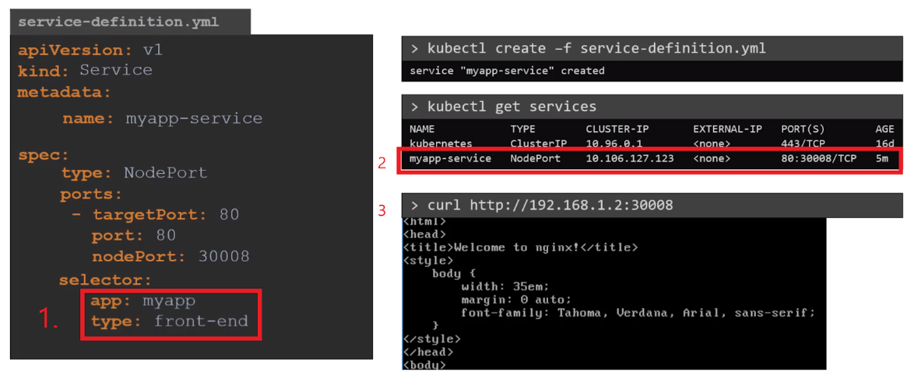

1. Link a service to a POD;
2. See that a service has been created;
3. Request (externally) a web-service via a node-IP address (192.168.1.2)


Service can be mapped NOT only to one POD. There are different cases:
* Service is mapped to one POD (the example above);
* Service is mapped to **many PODs** running on **the same Node**;
* Service is mapped to **many PODs** running on **different Nodes**;


#### Service is mapped to many PODs running on the same Node

This is use case example:

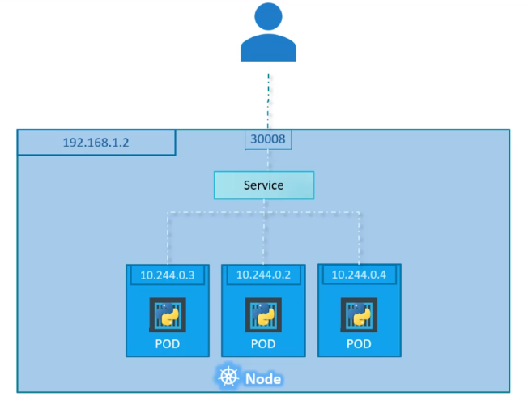

* Service is mapped to PODs via labels during creation of a service;
* Service automatically selects three pods as end-points to forward requests coming from users;
* you don’t need to make any additional configuration to make this happen!
* Service use a random algorithm to select a POD to forward requests;
* Here service is running as a load balancer to distribute load across different PODs;


#### Service is mapped to many PODs running on different Nodes

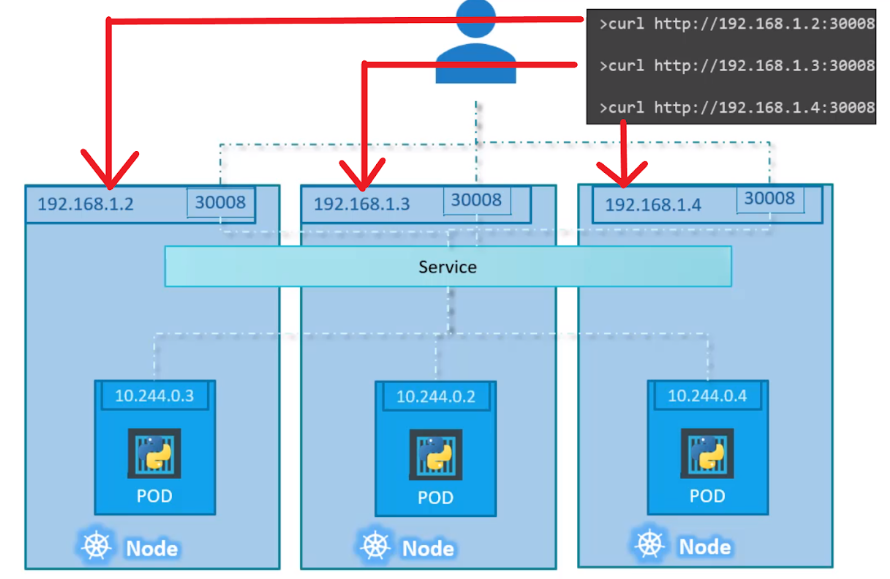

* Kubernetes automatically creates a service that spreads across all the nodes in a cluster and maps targetPort-s in PODs to the same service port;
* In that way you can access an application using an IP of any node in a cluster and using the same port (in the example it is 3008);
* When PODs are created/deleted a service is automatically updated;
* Normally when a service once created you don’t have to do anything with it; 


### Service CLusterIP

ClusterIP services provide a single interface to communicate one **group of PODs** with **another group** (can be also one-to-one POD):


#### Defifnition file

Here is the example of the ClusterIP service definition file:

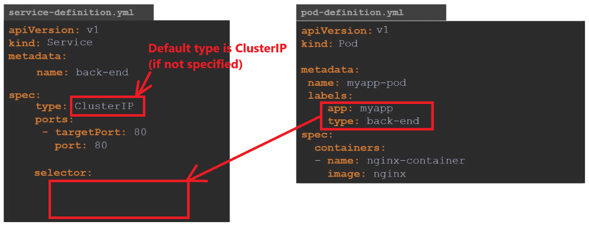

* **targerPort** - is a port where back-end is exposed;
* **port** - is a port where service is exposed; 
* for linking a service to a set of PODs we use selectors (labels in a POD);


#### Create and check

The following command is used to create a service from a definition-file (i.e from a manifest):

```
kubectl create -f service-definition.yaml
```

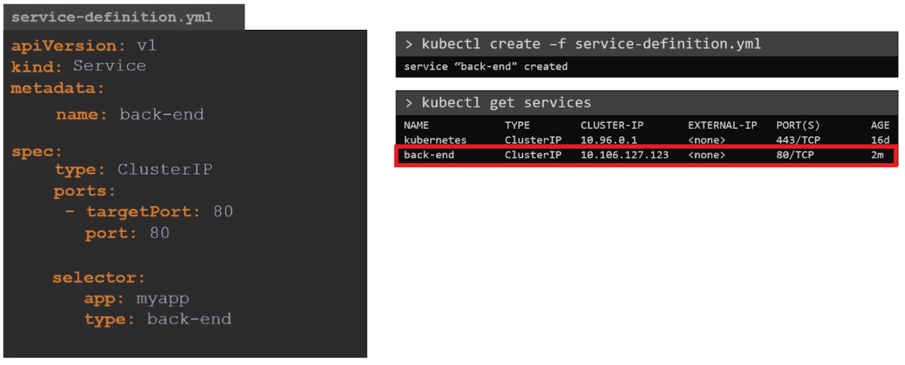

It is also possible to create a service exposing  a running pod with the command:

```
kubectl expose pod nginx --port=90 --target-port=80 --type=ClusterIP
```
* **type** is a type service (ClusterIP, NodePort or LoadBalancer). Default type is ClusterIP

More details regarding the "expose" command can be found in the [documentation](https://kubernetes.io/docs/reference/generated/kubectl/kubectl-commands#expose).

## Examples

### ClusterIP service

1. Create a POD with the image `nginx`:

```
kubectl run nginx --image=nginx
```

2. Check the created pod (use `kubectl get ...`, `kubectl describe ...`)

3. Create a POD with the image `busybox` and run there the command `sleep 3600`:

```
kubectl run busybox --image=busybox -it --restart=Never --  bin/sh -c 'sleep 3600'
```

4. Check the created pod;
5. Try to `curl ...` the POD `nginx` via its IP from the host (your PC);
6. Run `bin/sh` in the POD `busybox`:

```
kubectl exec -it busybox -- bin/sh
```
7. Try to `wget ...` the POD `nginx` via its IP from the POD `busybox`
8. Go back to the host machine;
9. Expose the POD `nginx` to the port 90:

```
k expose po nginx --name=ngninx-srv --port=90 --target-port=80
```
10. Run `bin/sh` again in the POD `busybox`:

```
kubectl exec -it busybox -- bin/sh
```

11. Try to `wget ...` the POD `nginx` via the service-name and port=90 from the POD `busybox`:

```
wget -O- nginx-srv:90
```

12. ssh to the minikube cluster:

```
minikube ssh
```

13. Try to `curl ...` the POD `nginx` via its IP and the service name

14. Delete the service and the POD `busybox`

### NodePort service
TODO


## Hands-on exercises
### Play with Services
1. Create a POD using a manifest with the following specification:

   - *POD name:* `nginx1` 
   - *Image:* `nginx`

2. Check the status of the created pod ("get", "describe"):

   - Wait till the status will be "running"

3. Create a `NodePort` service and expose the created POD to a port `30856`


4. Make a call to the POD via the port `30856` from your browser:

	```
	http://192.168.99.100:30856/
	```


