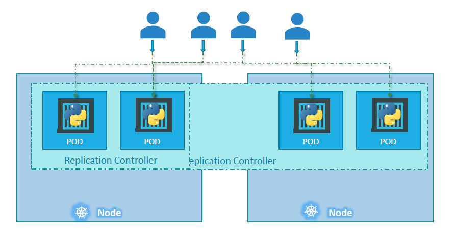

## Kubernetes Controllers and Deployment

Kubernetes Controllers are the brain behind Kubernetes. Controllers are processes that monitor kubernetes objects and respond accordingly. Let's consider one controller in particular - Replication Controller.

