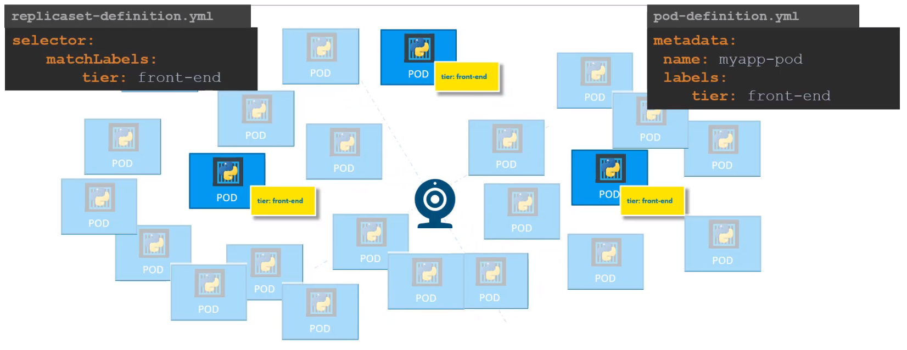

## Kubernetes Controllers and Deployment

Kubernetes Controllers are the brain behind Kubernetes. Controllers are processes that monitor kubernetes objects and respond accordingly. Let's consider one controller in particular - Replication Controller.

### Replication Controller

Replication Controller is used to provide customers with

* High Availability
* Load Balancing and Scaling

#### High Availability

When an application crashes for some reason the POD will fail. It means that users will no longer be able to access our application. To prevent users from losing access to our application, we would like to have more than one instance or POD running at the same time. 

That way if one fails we still have our application running on the other one. The replication controller helps to run and control multiple instances of a single POD in the kubernetes cluster thus providing **High Availability**.

Replica Controller works also for a single POD - if you have a single POD, the replication controller can help by automatically bringing up a new POD when the existing one fails. 
Thus the replication controller ensures that the specified number of PODs are running at all times. Even if it’s just 1 or 100.

#### Load Balancing and Scaling

#### ReplicaController vs ReplicaSet

#### Labels and Selectors

