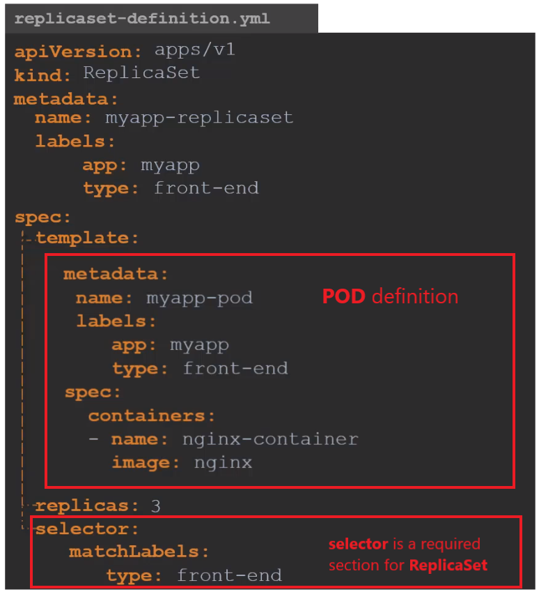

## Kubernetes Controllers and Deployment

Kubernetes Controllers are the brain behind Kubernetes. Controllers are processes that monitor kubernetes objects and respond accordingly. Let's consider one controller in particular - Replication Controller.

### Replication Controller

Replication Controller is used to provide customers with

* High Availability
* Load Balancing and Scaling


#### High Availability

When an application crashes for some reason the POD will fail. It means that users will no longer be able to access our application. To prevent users from losing access to our application, we would like to have more than one instance or POD running at the same time. 


That way if one fails we still have our application running on the other one. The replication controller helps to run and control multiple instances of a single POD in the kubernetes cluster thus providing **High Availability**.


Replica Controller works also for a single POD - if you have a single POD, the replication controller can help by automatically bringing up a new POD when the existing one fails. 
Thus the replication controller ensures that the specified number of PODs are running at all times. Even if it’s just 1 or 100.


#### Load Balancing and Scaling

Another reason we need replication controller is to create multiple PODs to share the load across them. When the number of users increase we deploy additional POD to balance the load across the pods. 

If the demand further increases and If we were to run out of resources on the first node, we could deploy additional PODs across other nodes in the cluster. 


As you can see, the replication controller spans across multiple nodes in the cluster. It helps us balance the load across multiple pods on different nodes.


#### ReplicaController vs ReplicaSet

There are two similar terms: **Replication Controller** and **Replica Set**. Both have the same purpose but they are not the same. Replication
Controller is the older technology that is being replaced by Replica Set. Replica set is the new recommended way to setup replication. 

This is how a ReplicaSet is created:



A section "selector" is a required section for ReplicaSet. This is a major difference between Replication Controller and Replica Set - in Replication Controller the section "selector" is NOT required but still available.PODs.

The ReplicaSet selector also provides many other options for matching labels that were not available in a replication controller.


#### Labels and Selectors

What is the deal with Labels and Selectors? Why do we label our PODs and objects in kubernetes? Let us look at a simple scenario. Say we deployed 3 instances of our frontend web application as 3 PODs:


We would like to create a replica set to ensure that we have 3 active PODs at anytime. This is one of the use cases of replica sets. 

You can use it to monitor existing pods, if you have them already created. In case they were not created, the replica set will create them for you. The role of the replicaset is to monitor the pods and if any of them were to fail, deploy new ones. The replica set is a process that monitors the pods. 

But how does the replicaset *know what pods to monitor*? There could be 100s of other PODs in the cluster running different application. This is
were labelling our PODs comes in handy. 

We could now provide these labels as a filter for replicaset. Under the selector section we use the **matchLabels** filter and provide the same label that we used while creating the pods. This way the replicaset knows which pods to monitor.

The same concept labels/selectors is used in many other places in Kubernetes.

#### Scale

How can we scale replicas? There are different ways to do this:

* Update the number of replicas in the definition file and run the kubectl **replace** command:

```
kubectl replace -f replica-definition.yml
```

* run the kubectl **scale** command:

```
kubectl scale --replicas=3 <replica-set-name>
```

### Deployment

TODO


