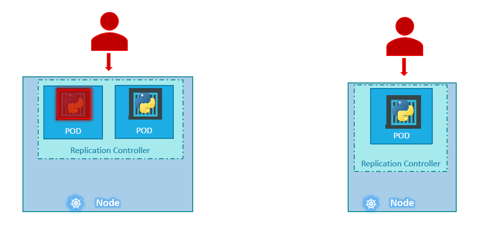
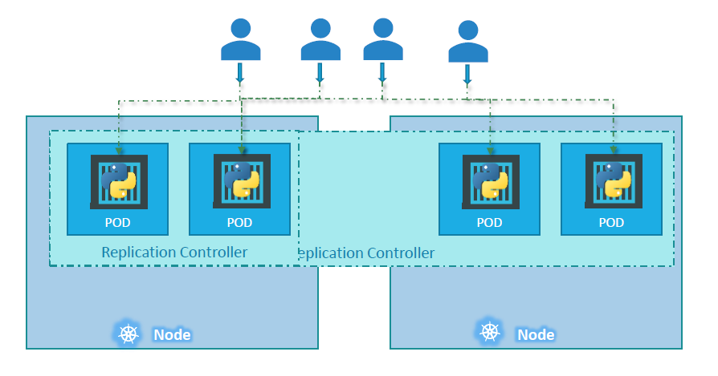
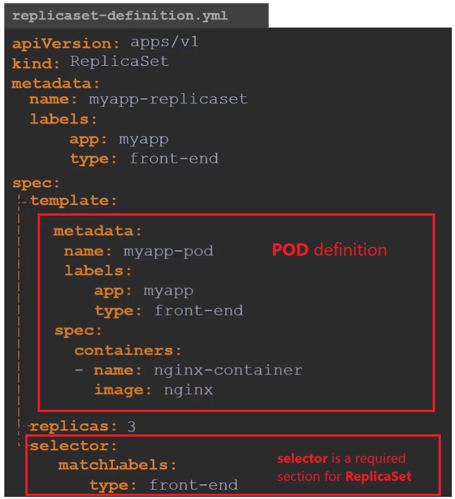
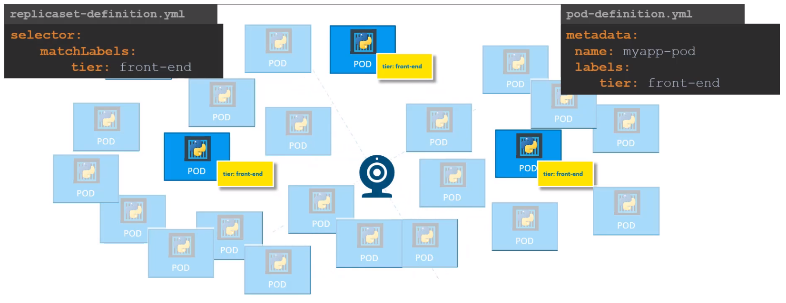
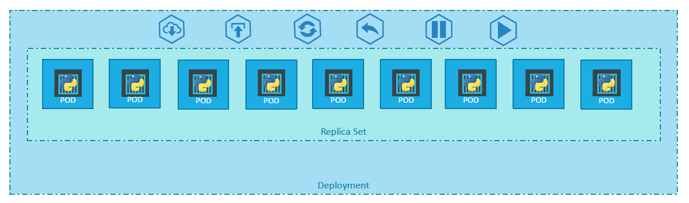
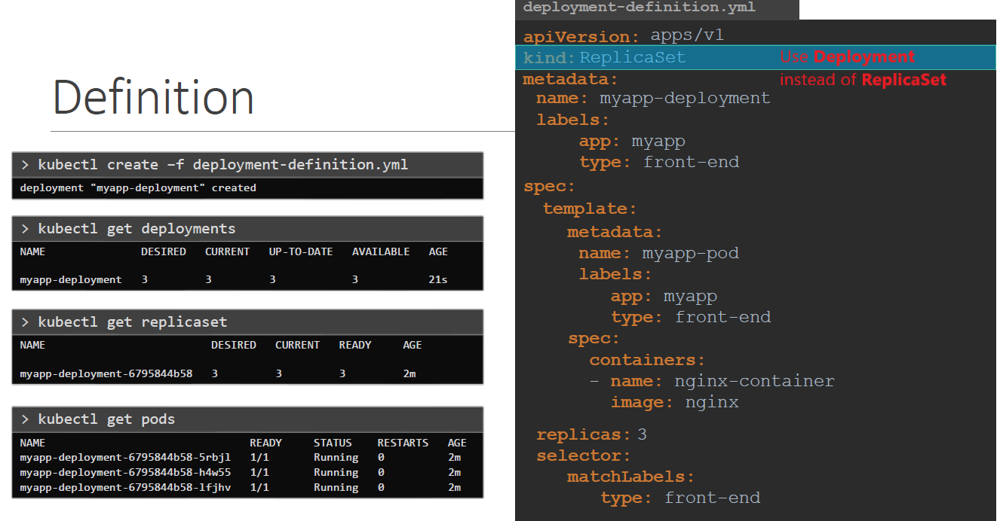
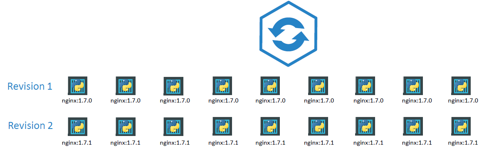
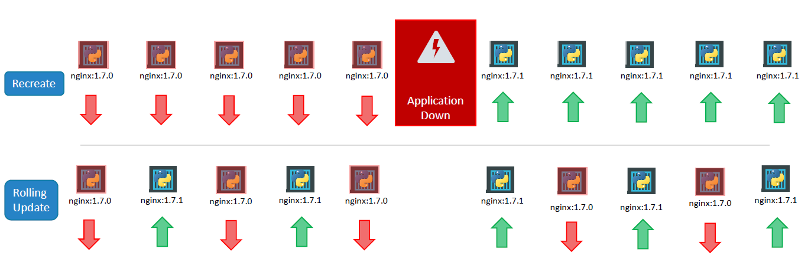
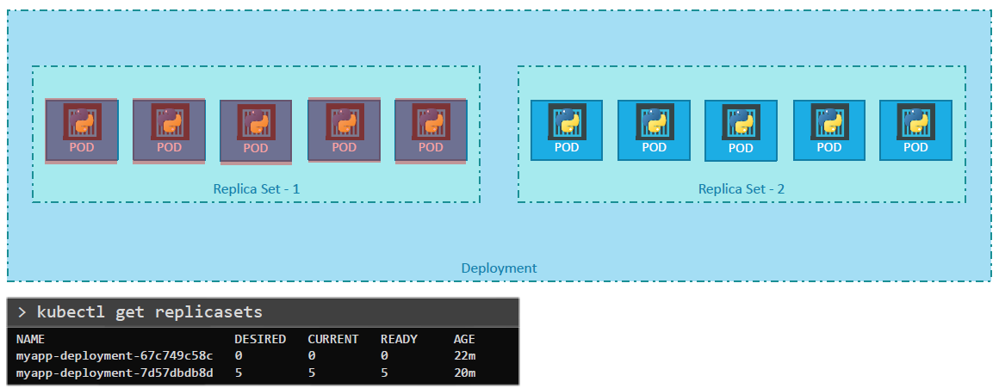
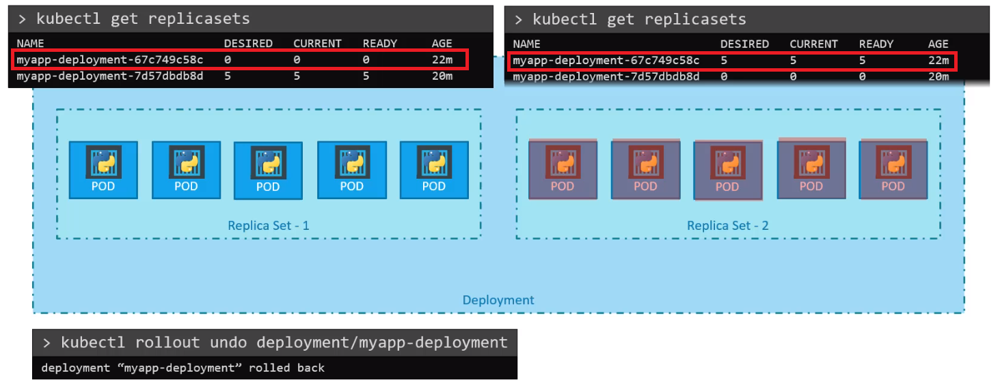

# Controllers and Deployment

## Replication Controller

Kubernetes Controllers are the brain behind Kubernetes. Controllers are processes that monitor kubernetes objects and respond accordingly. Let's consider one controller in particular - Replication Controller.

Replication Controller is used to provide customers with

* High Availability
* Load Balancing and Scaling


### High Availability

When an application crashes for some reason the POD will fail. It means that users will no longer be able to access our application. To prevent users from losing access to our application, we would like to have more than one instance or POD running at the same time. 


That way if one fails we still have our application running on the other one. The replication controller helps to run and control multiple instances of a single POD in the kubernetes cluster thus providing **High Availability**.



Replica Controller works also for a single POD - if you have a single POD, the replication controller can help by automatically bringing up a new POD when the existing one fails. 
Thus the replication controller ensures that the specified number of PODs are running at all times. Even if it’s just 1 or 100.


### Load Balancing and Scaling

Another reason we need replication controller is to create multiple PODs to share the load across them. When the number of users increase we deploy additional POD to balance the load across the pods. 

If the demand further increases and If we were to run out of resources on the first node, we could deploy additional PODs across other nodes in the cluster. 



As you can see, the replication controller spans across multiple nodes in the cluster. It helps us balance the load across multiple pods on different nodes.


### ReplicaController vs ReplicaSet

There are two similar terms: **Replication Controller** and **Replica Set**. Both have the same purpose but they are not the same. Replication
Controller is the older technology that is being replaced by Replica Set. Replica set is the new recommended way to setup replication. 

This is how a ReplicaSet is created:



A section "selector" is a required section for ReplicaSet. This is a major difference between Replication Controller and Replica Set - in Replication Controller the section "selector" is NOT required but still available.PODs.

The ReplicaSet selector also provides many other options for matching labels that were not available in a replication controller.


### Labels and Selectors

What is the deal with Labels and Selectors? Why do we label our PODs and objects in kubernetes? Let us look at a simple scenario. Say we deployed 3 instances of our frontend web application as 3 PODs:



We would like to create a replica set to ensure that we have 3 active PODs at anytime. This is one of the use cases of replica sets. 

You can use it to monitor existing pods, if you have them already created. In case they were not created, the replica set will create them for you. The role of the replicaset is to monitor the pods and if any of them were to fail, deploy new ones. The replica set is a process that monitors the pods. 

But how does the replicaset *know what pods to monitor*? There could be 100s of other PODs in the cluster running different application. This is
were labelling our PODs comes in handy. 

We could now provide these labels as a filter for replicaset. Under the selector section we use the **matchLabels** filter and provide the same label that we used while creating the pods. This way the replicaset knows which pods to monitor.

The same concept labels/selectors is used in many other places in Kubernetes.

### Scale

How can we scale replicas? There are different ways to do this:

* Update the number of replicas in the definition file and run the kubectl **replace** command:

```
kubectl replace -f replica-definition.yml
```

* run the kubectl **scale** command:

```
kubectl scale --replicas=3 <replica-set-name>
```

## Deployments

Deployment is a kubernetes object that comes higher than POD and ReplicaSet in the hierarchy. The deployment provides us with capabilities to upgrade the underlying instances seamlessly using rolling updates, undo changes, and pause and resume changes to deployments.



The following use cases are described in details in the [Kubernetes documentation](https://kubernetes.io/docs/concepts/workloads/controllers/deployment/#use-case):

* Create a Deployment to rollout a ReplicaSet. The ReplicaSet creates Pods in the background. Check the status of the rollout to see if it succeeds or not.
* Declare the new state of the Pods by updating the PodTemplateSpec of the Deployment. A new ReplicaSet is created and the Deployment manages moving the Pods from the old ReplicaSet to the new one at a controlled rate. Each new ReplicaSet updates the revision of the Deployment.
* Rollback to an earlier Deployment revision if the current state of the Deployment is not stable. Each rollback updates the revision of the Deployment.
* Scale up the Deployment to facilitate more load.
* Pause the Deployment to apply multiple fixes to its PodTemplateSpec and then resume it to start a new rollout. Use the status of the Deployment as an indicator that a rollout has stuck.
* Clean up older ReplicaSets that you don't need anymore.

### Create Deployment
The deployment definition file is very similar to ReplicaSet, just replace "ReplicaSet" with "Deployment":



It is also possible to creare a deployment with the command like this:
```
kubectl create deployment <deploymnt-name> --image=<image>
```

So far there hasn’t been much of a difference between replicaset and deployments, except for the fact that deployments created a new kubernetes object. We will see how to take advantage of the deployment later.


### Rollout and Versioning

Let’s look into Rollouts and Versioning in a deployment. 



Whenever you create a new deployment or upgrade the images in an existing deployment it triggers a Rollout. A **rollout** is the process of
deploying or upgrading your application containers. When you first create a deployment, it triggers a rollout. 

A new rollout creates a new Deployment revision (let’s call it Revision 1). In the future when the application is upgraded – a new rollout is triggered and a new deployment revision is created - Revision 2. 

This helps us keep track of the changes made to our deployment and enables us to rollback to a previous version of deployment if necessary.

To see the status of your rollout - run the command:

```
kubectl rollout status <deployment-name>
```

To see the revisions and history of rollout run the command:

```
kubectl rollout history <deployment-name>
```

### Deployment Strategy

 There are two types of deployment strategies:
 * Recreate
 * Rolling update



#### Recreate
 
The first strategy is to destroy all the old application instances and then create newer versions of application instances. Meaning first, destroy, for example, the 5 running instances and then deploy 5 new instances of the new application version. 

The problem with this as you can imagine, is that during the period after the older versions are down and before any newer version is up, the application is down and inaccessible to users. This strategy is known as the **Recreate** strategy, and this is NOT the *default* deployment strategy. 

#### Rolling update

The second strategy is were we do not destroy all of them at once. Instead we take down the older version and bring up a newer version one by one. This way the application never goes down and the upgrade is seamless.

if you do not specify a strategy while creating the deployment, it will assume it to be Rolling Update. In other words, RollingUpdate is the default Deployment Strategy.

There are a few ways to update a deployment:
* Modify a deployment-definition yaml-file and the command:

```
kubectl apply -f deployment-definition.yml
```

* Run the command to set a new image:

```
kubectl set image <deployment-name> deployment nginx=nginx:1.9.1
```

* Run the command to edit a running deployment:

```
kubectl edit deployment <deployment-name>
```

The difference between the recreate and rollingupdate strategies can also be seen when you view the deployments in detail. Run the command to see detailed information regarding the deployments: 

```
kubectl describe deployment <deployment-name>
```

You will notice when the Recreate strategy was used the events indicate that the old replicaset was scaled down to 0 first and the new replica set scaled up to 5. 

However when the RollingUpdate strategy was used the old replica set was scaled down one at a time simultaneously scaling up the new replica set one at a time.


### Upgrades

Let’s look at how a deployment performs an upgrade under the hoods. 

When you upgrade your application the kubernetes deployment object creates a **NEW replicaset** under the hoods and starts deploying the containers there. At the same time taking down the PODs in the old replica set following a RollingUpdate strategy.



This can be seen when you try to list the replicasets using the command: 

```
kubectl get replicasets 
```

Here we see the old replicaset with 0 PODs and the new replicaset with 5 PODs.


### Rollback

Kubernetes deployments allow to rollback to a previous revision. 



To undo a change run the command:

```
kubectl rollout undo <deployment-name>
```

The deployment will then destroy the PODs in the new replicaset and bring the older ones up in the old replicaset . And your application is back to its older format.


When you compare the replicasets before and after the rollback, you will be able to notice the difference. Before the rollback the first replicaset had 0 PODs and the new replicaset had 5 PODs and this is reversed after the rollback is finished.

## Hands-on exercises
1. Create a new deployment:

```
kubectl create deployment my-dep --image=nginx
```
2. Check the created deployment (use the commands "get" and "describe")

3. Check replicas and PODs;

4. Scale replicas up to 3
```
kubectl scale --replicas=3 deploy/my-dep
```
5. Check number of running pods

6. Check the rollout status of the deployment:
```
kubectl rollout status deployment/my-dep
```

7. Check the rollout history of the deployment:
```
kubectl rollout history deployment/my-dep
```

8. Set a new image for the deployment:
```
kubectl set image deploy/my-dep nginx=nginx:1.9.1
```

9. Check the rollout status, history. 

10. Check the deployment to see it the new image has been applied 
```
kubectl describe deployment my-dep
```

11. Update the deployment with a wrong image:
```
kubectl set image deploy/my-dep nginx=nginx:1.9.99
```

12. Check the replicas, deployment status, pods

13. Check the rollout history

14. Undo the last deployment with a wrong image:
```
kubectl rollout undo deploy/my-dep
```

15. Check the rollout history

16. Check the replicas, deployment, pods
