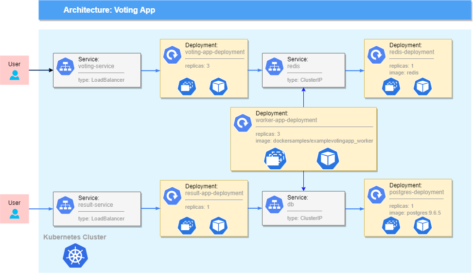

# Assignment

Create a kubernetes implementation of the famous [Voting App](https://github.com/dockersamples/example-voting-app) example

## Arcitecture

Task: deploy all micriservices according to the architechture

## Steps
TODO
