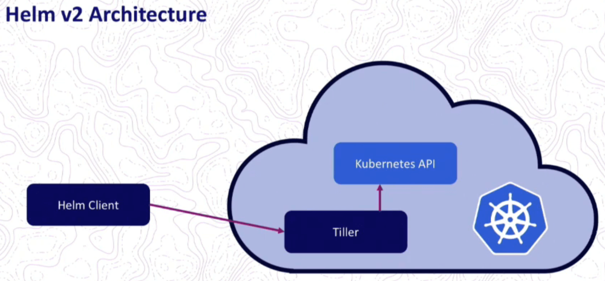
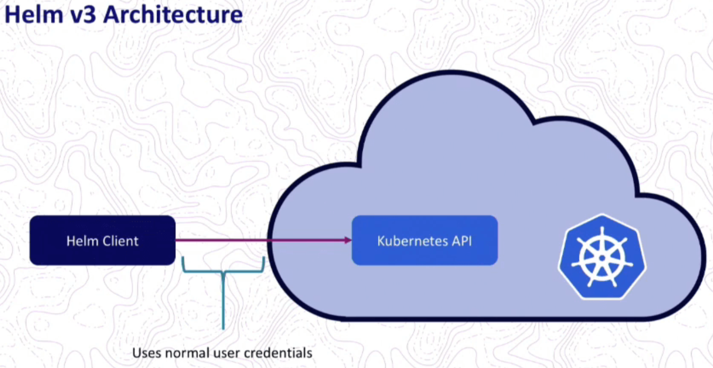

(under construction)
# Introduction to Helm

- Why do we need Helm
- What is Helm
- Helm Architecture
- Creating your first Helm chart 
- Helm templating
- Values and parameters
- Installing and Upgrading a chart
- Control flows
- Helm Repositories

## Why do we need Helm
In Kubernetes we describe everything what we do with yaml-files. These yaml-fails represent objects such as deployments, pods, services and so on. The objects are represented in **declarative** way. It means we tell Kubernetes exactly what we need and Kubernetes makes it happen. 

But managing all yaml-files can sometimes become a bit complicated. We may have many different yaml-files needed to deploy our applications/services to a Kubernetes cluster. All these yaml-s makes up our application and its infrastructure. 

It is important to notice here that all the yaml-s are not **reusable**. It means that if we want to build another application - we will have to copy/paste all the yaml-s and then change what is needed. If we need to deploy more applications we may end up with lots of yaml-s and lots of duplication. 

In over time these yaml-s may become hard to manage. And this is where Helm comes in.

## What is Helm
Helm is a package manager for Kubernetes. It is maintained by the [CNCF](https://cncf.io/) - in collaboration with  Microsoft,  Google,  [Bitnami](https://bitnami.com/) and the Helm contributor community. We can think of Helm as *apt*, *yum* or *Homebrew* for Kubernetes.

Helm allows up to bring all yaml-files together and in what's called a ***Chart***. A chart can have a *name*, a *description* and a *version*. 

A chart groups all yaml-s together in a folder called ***templates***. To make this chart reusable we have the ability to inject values as parameters. We can deploy a chart and inject a name which we can use in our deployment, for example APP-1. We can reuse this chart and deploy it into the same Kubernetes cluster or somewhere else with another name - APP-2. 

Once we have this chart we can effectively reuse all yaml-s by injecting parameters into it. This gives us greater flexibility as we can reuse the chart among many applications and micro-services. 

*Injecting parameters in a chart makes our chart **generic***.


## Arcitecture

First we have to distinguish Helm 2 and Helm 3. 

#### Helm 2
In  the version 2 Helm installation comes in two parts: a ***Helm Client*** (CLI) and a server called ***Tiller***:




This architecture offers additional valuable feature which is **Release Management**. 

*Release Management*<br/>
Whenever you create or change deployment Tiller will store a copy of each configuration for future reference. In this way Tiller creates a history and keeps track of all chart executions. This allows to rollback to a previous revision in a case of any issue with a new deployment.

But Helm 2 architecture has a big caveat because Tiller has too much power inside of a Kubernetes cluster:
* Tiller can create, updated, delete components;
* Tiller has too much permissions within a cluster. 

This makes a big security issue. This is a reason why Tiller has been removed in Helm 3.


#### Helm 3
Helm 3 uses the client-only architecture:



Removing Tiller has solved a security concern making Helm more secure. But this also makes *Release Management* feature more challenging. 

## Creating your first Helm chart 

Helm chart is a *unit of deployment*, it is made up with a set of yaml files. We can have a chart for microservices or any software like Redis, MySQL, Prometeus and so on.

Use the following command to create a chart called `example-app`:

```
helm create example-app
```

This will create a new folder `example-app`:

```
└── example-app							
    ├── charts						# Charts that this chart depends on
    ├── Chart.yaml					# Information about your chart (Chart name, version, description)
    ├── templates					# The template files
    │   ├── deployment.yaml
    │   ├── _helpers.tpl
    │   ├── ingress.yaml
    │   ├── NOTES.txt
    │   ├── serviceaccount.yaml
    │   ├── service.yaml
    │   └── tests					# The test files (optional, can be removed)
    │       └── test-connection.yaml
    └── values.yaml					# The default values for your templates
```    


## Work with Helm

TODO: clone a repo

Let's go ahead and see what Helm allows us to do.

### Test templates

Before installing a chart it always makes sense to test rendering of templates 

```
helm template api-demo-chart .
```

Helm will generate all yaml-s without deploying them to a cluster. 

Helm `template` command is a really powerful command which allows us to test our templates by generating row kubernetes yaml-s. If anything is wrong with the templates then the command will generate an error.

### Install a chart

To Install  the chart run the command `install`:
```
helm install api-demo-chart .
```
Helm will install everything what is a part of the chart to a Kubernetes cluster.

#### List releases

Every time Helm deploys a chart it will create a release where it tracks the revision. The command `list` can be used to check revisions:

```
helm list
```

You can check all the components deployed into a cluster:

```
kubectl get all
```

### Values and parameters

Values file and the parameter injection allows us to inject values into our chart making it reusable. 

api-deployment.yaml:
``` javascript 
    spec:
      containers:
      - name: api-app
        image: {{.Values.apiApp.image.repository}}:{{.Values.apiApp.image.tag}}
        ports:
        - containerPort: 80
        envFrom:
        - configMapRef:
            name: api-config
```

values.yaml:
```
apiApp:
  image:
    repository: ebd622/springboot-helm-demo
    tag: 1.0.0
```

If you upgrade your values you are allowed to override them at the time of deployment. You can inject your custom values file with the command `upgrade`:

```
helm upgrade api-demo-chart . --values values.yaml
```

Helm will also upgrade our release.

When you simply need to override one or two values in your deployment you can do it over th command line:

```
helm upgrade api-demo-chart . --set apiApp.image.tag=2.0.0
```

In this case you can use a command line instead of using a values-file.

So, you can use this templating engine and notations to replace pretty  much anything you like making you chart more generic. 

For example, you can create a generic chart to allow your teams to deploy their microservices and share the same chart among many services. You will only need to use different `values.yaml` file.

### Keep track on releases

Every time when you create/upgrade your deployment Helm will create a new release.

The command `history` is used to see all releases:

```
helm history api-demo-chart
```

Run the command `rollback` if you want to rollback to one of the previous releases:
```
helm rollback api-demo-chart 2 --dry-run
helm rollback api-demo-chart 2
```

